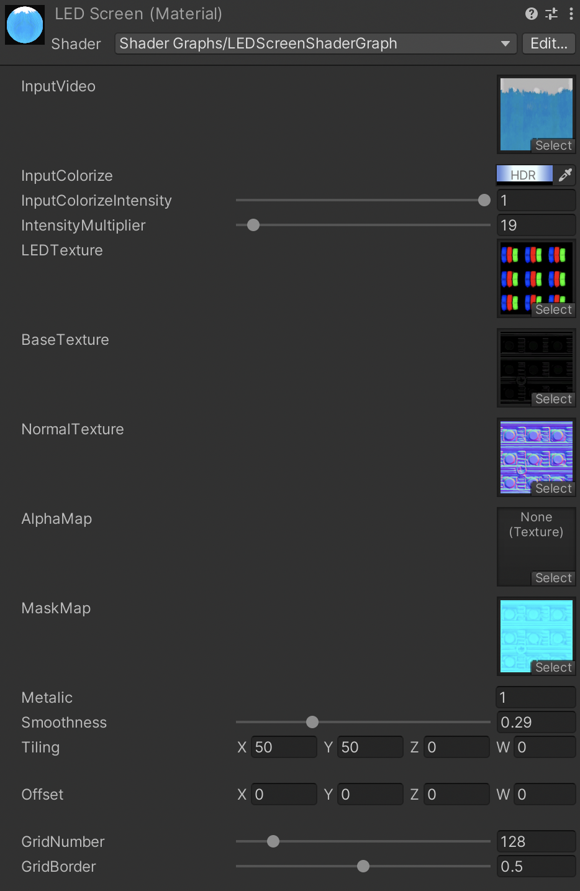
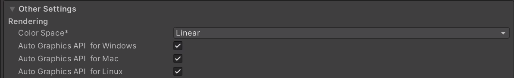

# LEDScreenShader

**LEDScreenShader is a native HLSL shader for rendering realistic LED panels in Unity.** 
**LEDScreenShaderはUnity上で高品質なLEDパネル表現を行うネイティブHLSLシェーダーです。** 

The current version replaces the previous Shader Graph implementation with a native shader (`llcheesell/LEDScreen`). It is designed for HDRP and URP, with a simplified Built-in Render Pipeline fallback shader included for compatibility only.

現在のバージョンでは、従来のShader Graph実装からネイティブシェーダー（`llcheesell/LEDScreen`）へ移行しています。主な対応対象はHDRP / URPです。Built-in Render Pipeline向けには簡易的なFallbackシェーダーを同梱していますが、公式サポート対象外です。

## Render Pipeline Support

* **HDRP** — Supported and tested.
* **URP** — Supported and tested.
* **Built-in Render Pipeline** — A simplified fallback shader is included, but Built-in is not officially supported or actively verified.

HDRP / URPではUnity 2021およびUnity 6000.3.15で動作確認しています。Built-in Render Pipelineは未検証のため、サポート対象外として扱います。

## Features

* **Native HLSL Shader** — Uses a single main shader instead of separate Shader Graph assets for each render pipeline.
* **Subpixel RGB Separation** — LED texture RGB channels act as per-subpixel masks, reproducing red, green, and blue LED elements.
* **Procedural LED Patterns** — Includes procedural LED layouts such as stripe, grid, and honeycomb.
* **HDR Brightness Control** — Intensity Multiplier is suitable for high-luminance HDRP/URP scenes.
* **FOV-Corrected Distant Fader** — Reduces moire by fading LED detail according to camera distance and field of view.
* **DDX/DDY Auto-Fade** — Uses screen-space coverage to automatically reduce excessive LED detail.
* **Cabinet Grid** — Renders panel cabinet seams with configurable width, depth, and per-cabinet brightness variation.
* **Motion Vectors** — Provides camera motion vector support for TAA ghosting reduction in HDRP/URP.

## Samples

* HDR brightness control

* Includes multiple LED panel textures

* Distant Fader for moire reduction

## Usage

1. Create a new material and set the shader to `llcheesell/LEDScreen`.
2. Set the texture or RenderTexture to **Input Texture**.
3. Select an LED texture or procedural LED pattern.
4. Adjust **Intensity Multiplier** based on the scene exposure and bloom settings.

## Main Properties

**Input**

* **Input Texture** (`_InputTex`) — The texture or RenderTexture shown on the panel. 
パネルに表示するテクスチャ、またはRenderTextureを指定します。
* **Input Tiling/Offset** (`_InputTex_ST`) — Tiling and offset for the input texture.

**LED**

* **LED Texture** (`_LEDTex`) — RGB subpixel mask texture. R/G/B channels define which subpixel areas light up. 
LEDの発光パターンを指定します。R/G/Bチャンネルがそれぞれサブピクセルのマスクとして機能します。
* **Procedural LED** — Generates LED layouts procedurally without a texture. 
テクスチャを使わず、シェーダー内でLED配列を生成します。
* **LED Tiling** (`_LEDTiling`) — Number of LED tiles in X/Y. 
LEDパターンのタイリング数を設定します。

**Brightness**

* **Intensity Multiplier** (`_IntensityMultiplier`) — Emission intensity for HDR lighting and bloom workflows.

**Distant Fader**

* **Distant Fade Start/End** (`_DistantFadeStart`, `_DistantFadeEnd`) — Distance range where LED detail fades to reduce moire. 
カメラ距離に応じてLEDディテールをフェードし、モアレを抑制します。
* **Distant Fade Brightness** (`_DistantFadeBrightness`) — Brightness compensation applied while LED detail is faded.

**Cabinet Grid**

* **Cabinet Grid Enabled** (`_CabinetGridEnabled`) — Toggles cabinet seam rendering.
* **Cabinet Tiling** (`_CabinetTiling`) — Number of cabinet modules in X/Y.
* **Cabinet Seam Width/Depth** — Controls seam width and indentation strength.
* **Cabinet Brightness Variance** — Adds subtle luminance variation per cabinet.

**Base Material**

* **Base Texture / Normal Map / Mask Map** (`_BaseMap`, `_NormalMap`, `_MaskMap`) — PBR surface properties. MaskMap channels: R=Metallic, G=AO, A=Smoothness. 
パネル本体のベースマテリアルを設定します。

## Notes

* Linear Color Space is recommended. Gamma Color Space can clamp bright areas more easily. 
リニアカラースペースでの使用を推奨します。

* Bloom post-processing is recommended for realistic LED brightness. 
リアルなLED発光表現にはBloomポストエフェクトの併用を推奨します。

* Built-in Render Pipeline is not officially supported. The included fallback shader is intended only as a simplified compatibility path. 
Built-in Render Pipelineは公式サポート対象外です。同梱のFallbackシェーダーは簡易互換用として扱ってください。

* Legacy Shader Graph files are preserved in `Shaders/Legacy/` for reference only. The main supported shader is `llcheesell/LEDScreen`. 
旧Shader Graphファイルは参考用として`Shaders/Legacy/`に残しています。現在の主なサポート対象は`llcheesell/LEDScreen`です。

## License

Under [MIT License](LICENSE) 
*Credit, or notice of use is not required but much appreciated!*
